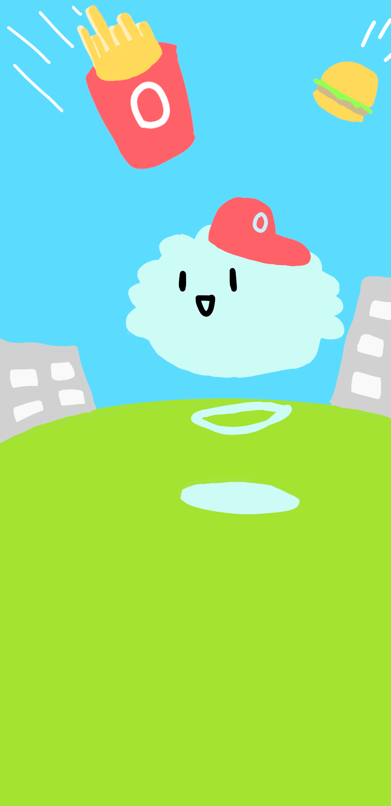
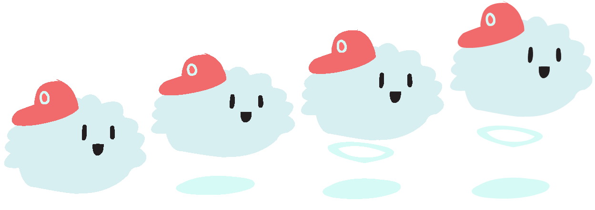

# OddJobs Jeeve
OddJobs Jeeve is a platformer game targeted towards children with the purpose of entertainment. Children would be enamoured with the cute design of the website where they will be playing as this cute puffle creature named Jeevies. Currently the website is solely made as a passion project in order to give smiles to children. 

The story concept of the game is that Jeeve is working hard to earn money in the city of Jeevies and it is constantly working odd jobs to get by. Each level would represent a different job such as the first level following a fast food worker theme and the second level following a laundromat theme. 

The gameplay, consists of a platformer mechanic where the player would move Jeeve through platforms to collect items. Each item would give them an amount of points. For example, in the first level, the burger item would be +20 points, the fries item would be +10 points, the soda item would be +5 points.

We implemented a highscore leaderboard to spark our players competitiveness while playing the game. After each level, a leaderboard would be displayed showing the top 10 players that scored the top 10 highest scores.

## Design Process
 
Provide us insights about your design process, focusing on who this website is for, what it is that they want to achieve and how your project is the best way to help them achieve these things.

In particular, as part of this section we recommend that you provide a list of User Stories, with the following general structure:
- As a user type, I want to perform an action, so that I can achieve a goal.

This section is also where you would share links to any wireframes, mockups, diagrams etc. that you created as part of the design process. 
These files should themselves either be included as a pdf file in the project itself (in an separate directory)
Include the Adobe XD wireframe as a folder. You can include the XD share url. 

Since this game is dedicated to children, we choose a bright color pallete to use in the design of the game. This is because children are more likely to be more attentive while playing the game if it is colored with flashy and bright colors instead of dull and neutral colors. This can be seen in out design of the homepage shown below.

We made the design of the character to be cute and innocent looking by using soft strokes and more curved lines. We also choose to make our homepage more lively by adding a lottie animation of the avatar jumping up and down happily. This to give the impression of friendliness and joy to children while they are playing the game.

## Features

In this section, you should go over the different parts of your project, and describe each in a sentence or so.
 
### Homepage
- Feature 1 - allows users X to achieve Y, by having them fill out Z
- ...

### Level
- Feature 1 - allows users X to achieve Y, by having them fill out Z
- ...

### Game
- Feature 1 - allows users X to achieve Y, by having them fill out Z
- ...

In addition, you may also use this section to discuss plans for additional features to be implemented in the future:

### Features Left to Implement
- Another feature idea

## Technologies Used

- [HTML](https://www.w3schools.com/html/)
    - The project uses **HTML** to create content for the web game.
- [CSS](https://www.w3schools.com/css/)
    - **CSS** to style the content of the web game.
- [Normalize CSS](https://necolas.github.io/normalize.css/)
    - **Normalize CSS** was used to normalize styles across browsers so that the style will be consistent.
- [JavaScript](https://www.javascript.com/)
    - **JavaScript** to allow the web game to be interactive and API implementation.
- [Lottie](https://lottiefiles.com/editor)
    - **Lottie** was used to create avatar animation.
- [Photoshop](https://www.adobe.com/sg/products/photoshop.html)
    - **Photoshop**
- [Adobe Illustrator](https://www.adobe.com/sg/products/illustrator.html)
    - **AI** was used to create Sprite Sheet for the movement of characters in game.
- [Font Awesome](https://fontawesome.com/icons)
    - Retrived icon design from font awesome.
- [RestDB](https://restdb.io)
    - **RestDB** for storing username and password. 
- [JQuery](https://jquery.com/)
    - Collection of the "items" in each web game level.
- [Canvas](https://www.w3schools.com/tags/ref_canvas.asp)
    - **Canvas** was used to draw graphics via scripting(js). For instance, background the the web game
- [DOM](https://www.w3schools.com/js/js_htmldom.asp)
    - **DOM** comprise the structure and content of a document on the web.
- Recorder
    - **Recorder** was used to record the music played in the web game.

## Testing

For any scenarios that have not been automated, test the user stories manually and provide as much detail as is relevant. A particularly useful form for describing your testing process is via scenarios, such as:

1. Contact form:
    1. Go to the "Contact Us" page
    2. Try to submit the empty form and verify that an error message about the required fields appears
    3. Try to submit the form with an invalid email address and verify that a relevant error message appears
    4. Try to submit the form with all inputs valid and verify that a success message appears.

In addition, you should mention in this section how your project looks and works on different browsers and screen sizes.

You should also mention in this section any interesting bugs or problems you discovered during your testing, even if you haven't addressed them yet.

If this section grows too long, you may want to split it off into a separate file and link to it from here.

## Credits

### Content
- [CodePen](https://codepen.io/)
   - Reference for the signup section

### Media
- Credit to Hanisah for the lottie animation and photoshop avatar inculding background
- Credit to Qing Ling for the adobe illustrator for the game items

### Acknowledgements

- I received inspiration for this project from platformer game **mario**
