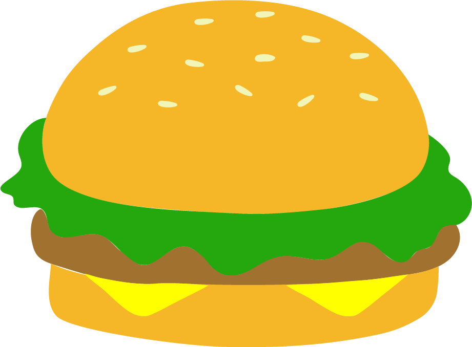
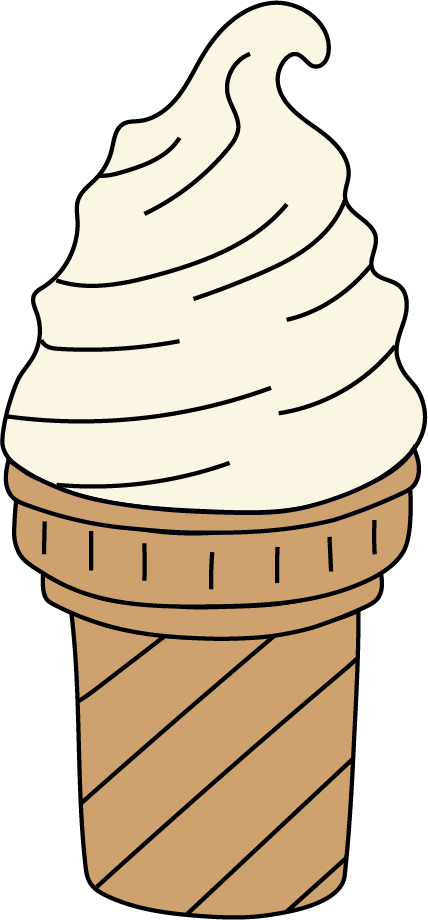

# OddJobs Jeeve
OddJobs Jeeve is a platformer game targeted towards children with the purpose of entertainment. Children would be enamoured with the cute design of the website where they will be playing as this cute puffle creature named Jeevies. Currently the website is solely made as a passion project in order to give smiles to children. 

The story concept of the game is that Jeeve is working hard to earn money in the city of Jeevies and it is constantly working odd jobs to get by. Each level would represent a different job such as the first level following a fast food worker theme and the second level following a laundromat theme. 

The gameplay, consists of a platformer mechanic where the player would move Jeeve through platforms to collect items. Each item would give them an amount of points. For example, in the first level, the burger item would be +20 points, the fries item would be +10 points, the soda item would be +5 points.

We implemented a highscore leaderboard to spark our players competitiveness while playing the game. After each level, a leaderboard would be displayed showing the top 10 players that scored the top 10 highest scores.

## Design Process
After we decided on our theme, we made a low fidelity wireframe as seen here. This would be a draft for our future edits.

Since this game is dedicated to children, we choose a bright color pallete to use in the design of the game. This is because children are more likely to be more attentive while playing the game if it is colored with flashy and bright colors instead of dull and neutral colors. This can be seen in out design of the homepage shown below.

We made the design of the character to be cute and innocent looking by using soft strokes and more curved lines. We also choose to make our homepage more lively by adding a lottie animation of the avatar jumping up and down happily. This to give the impression of friendliness and joy to children while they are playing the game.

We made 4 lottie animations where 2 were static and 2 were looped. The static ones are of fries and burger and the looped ones are of the avatar bouncing and swaying cutely. 
- [avatar-bouncing](https://lottiefiles.com/share/9cdoucbf)
- [avatar-swaying](https://lottiefiles.com/share/fdnpwmcq)
- [fries](https://lottiefiles.com/share/futh09vo)
- [burger](https://lottiefiles.com/share/rnzjt248)

We made a sprite sheet which is made with pixels in photoshop for the game

We made icons in illustrator that the player need to collect

We also made music and soundeffect for the user to enjoy.

## Features 
### Homepage
- When the user clicks on the moving effect logo ("Odd Jobs"), a sound effect is played.
- When the user clicks on the music icon, music would be played
- User would be greeted by looped lottie of the character bouncing and static lotties of food which are representative of the game items.
- The instruction button would redirect the user to the instructions page
- The START GAME button would redirect the user to the login page

### Login 
- On the login page, player should input their account information, such as their username and password, which they created previously
- The sign up button enables the player to access a pop-up mini-signup form/page
- User can click on the round play button to redirect them into the level selection page
- Player can return to the home page by clicking the round back button
- There is also a music button for the user to listen to the music

### Sign up
- Player can enter their login and password into a pop-up mini signup form/page, which will be saved in the database system

### Level
- This page allows users to view both unlocked and locked game levels
- The locked levels are not clickable and cannot redirect the player to the game's level web page.
- The unlocked level is clickable, and clicking it redirects the player to the game's web page.
- There is also a music button for the user to listen to the music
- There is a return to menu button also

### Game
- This page is the game where user can use arrow keys on the keyboard to move the player 
- The player would have to avoid lava while collecting burgers
- If they collect all the burgers, they win and would be redirected to the main page
- If they touch the lava, they lose and would be redirected to the main page.
### Features Left to Implement
- Highscore leaderboard where the top players would have their name and highscore listed in the game over or game win screen.
- Character customisation where the player can choose what color the avatar can be in.

## Technologies Used

- [HTML](https://www.w3schools.com/html/)
    - The project uses **HTML** to create content for the web game.
- [CSS](https://www.w3schools.com/css/)
    - **CSS** to style the content of the web game.
- [Normalize CSS](https://necolas.github.io/normalize.css/)
    - **Normalize CSS** was used to normalize styles across browsers so that the style will be consistent.
- [JavaScript](https://www.javascript.com/)
    - **JavaScript** to allow the web game to be interactive and API implementation.
- [Lottie](https://lottiefiles.com/editor)
    - **Lottie** was used to create avatar animation.
- [Photoshop](https://www.adobe.com/sg/products/photoshop.html)
    - **Photoshop**
- [Adobe Illustrator](https://www.adobe.com/sg/products/illustrator.html)
    - **AI** was used to create Sprite Sheet for the movement of characters in game.
- [Font Awesome](https://fontawesome.com/icons)
    - Retrived icon design from font awesome.
- [RestDB](https://restdb.io)
    - **RestDB** for storing username and password. 
- [JQuery](https://jquery.com/)
    - Collection of the "items" in each web game level.
- [Canvas](https://www.w3schools.com/tags/ref_canvas.asp)
    - **Canvas** was used to draw graphics via scripting(js). For instance, background the the web game
- [DOM](https://www.w3schools.com/js/js_htmldom.asp)
    - **DOM** comprise the structure and content of a document on the web.
- Voice recorder
    - **Recorder** was used to record the music played in the web game.

## Testing

1. Sign up form:
    1. Go to the "Login" page and press the "Sign up" button
    2. Try to submit the empty form and verify that an error message about the required fields appears
    3. Try to submit the form with all inputs valid and verify that a success message appears.

This project works on chrome in desktop and samsung mobile view.

Chrome has this policy where they dont allow autoplay so even though we wanted the music to be autoplayed, we are unable to implement it in chrome. So we decided to scrap the autoplay idea and just have the users play the music by themselves. 

### Credits and Content
- [CodePen](https://codepen.io/)
   - Reference for the signup section
- Youtube account (https://www.youtube.com/watch?v=w-OKdSHRlfA) from freeCodeCamp.org by Poth on Programming
  - Reference for the game

### Media
- Credit to Hanisah for the lottie animation and photoshop avatar inculding background
- Credit to Qing Ling for the adobe illustrator for the game items
- Credit to Font Awesome for providing good free icons!

### Acknowledgements
- We received inspiration for this project from platformer game **mario**
